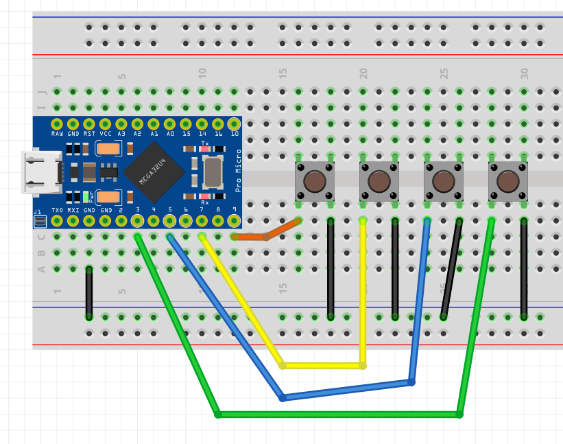

# 4buttons

This is a 4 button direct wired macropad with Vial support. No diodes, single layer in Vial.

I'm a newb - just trying to figure all this out with documentation and examples I can find online, so I figured I'd post mine. 

----
See the [build environment setup](https://docs.qmk.fm/#/getting_started_build_tools) and the [make instructions](https://docs.qmk.fm/#/getting_started_make_guide) for more information. Brand new to QMK? Start with our [Complete Newbs Guide](https://docs.qmk.fm/#/newbs).
